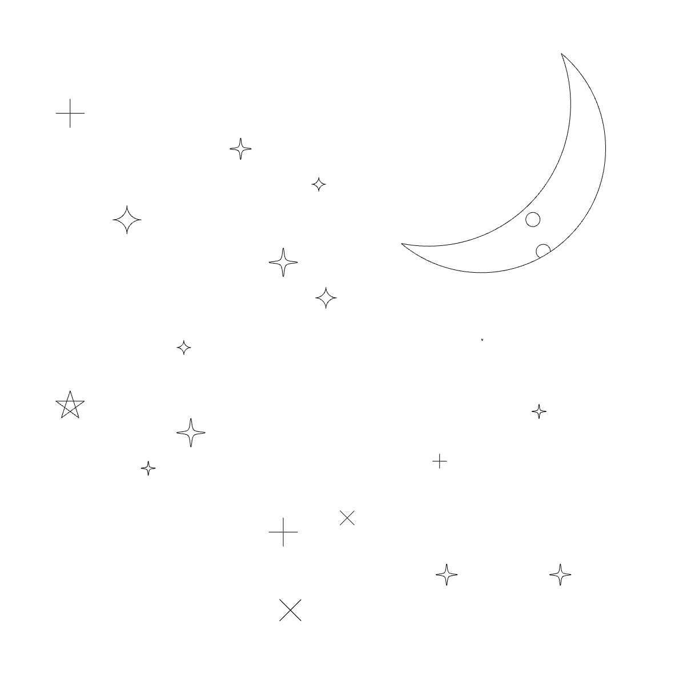
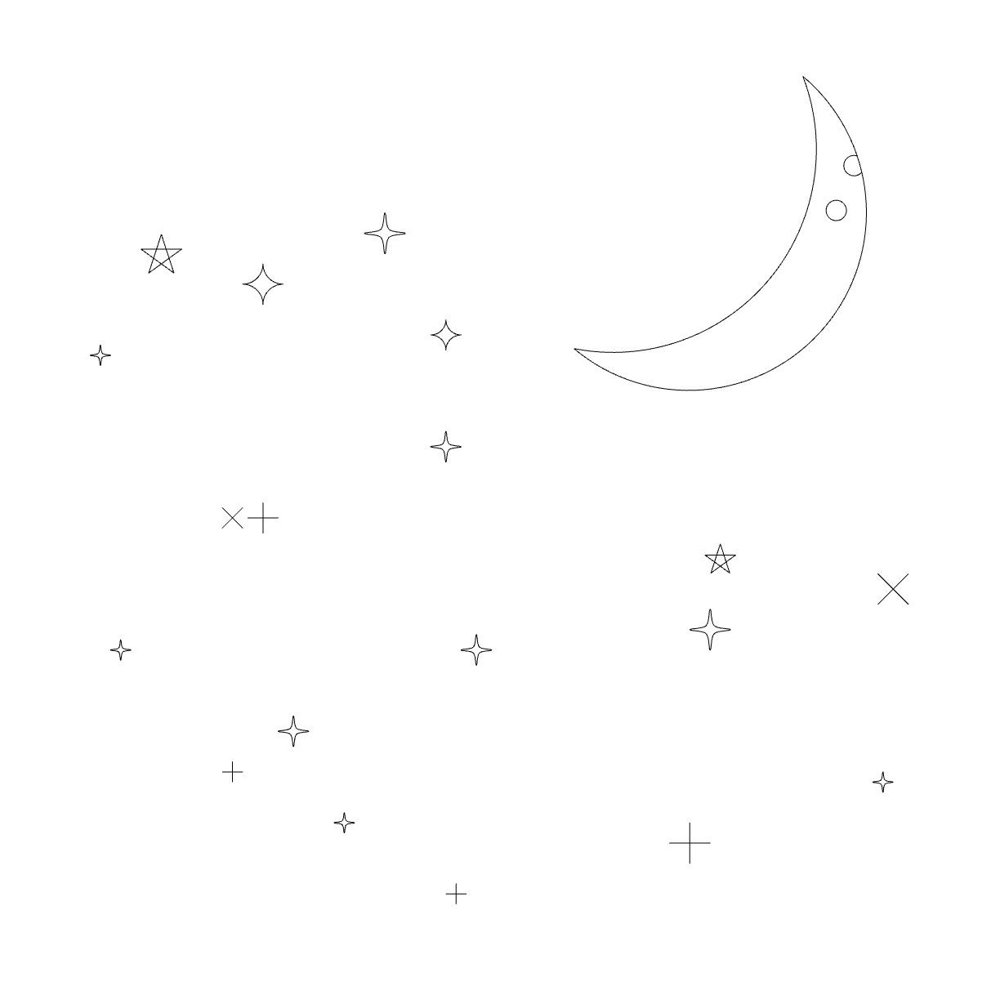

    
    <h1>Nightsky</h1>
    

        <b>A starry night. Now on your <a href="https://hackclub.com/blot">Blot!</a></b>
    

    

        
        
        
        
    

     
     
     

## Usage

Copy the contents of [index.js](https://github.com/khrj/nightsky/blob/main/index.js) to [the Blot editor ↗](https://blot.hackclub.com/editor)

## More screenshots

