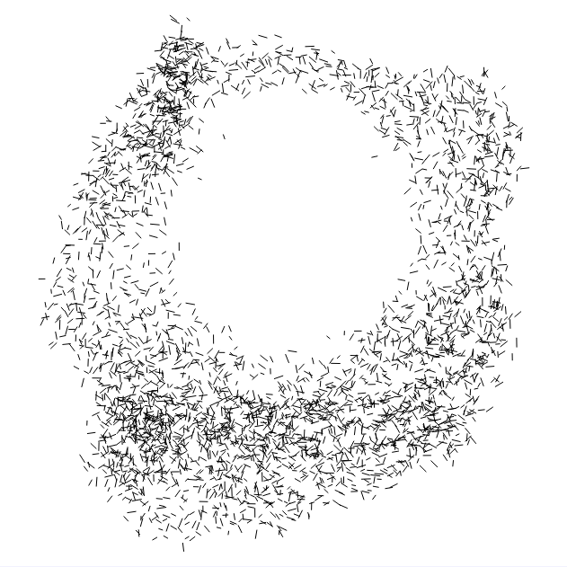
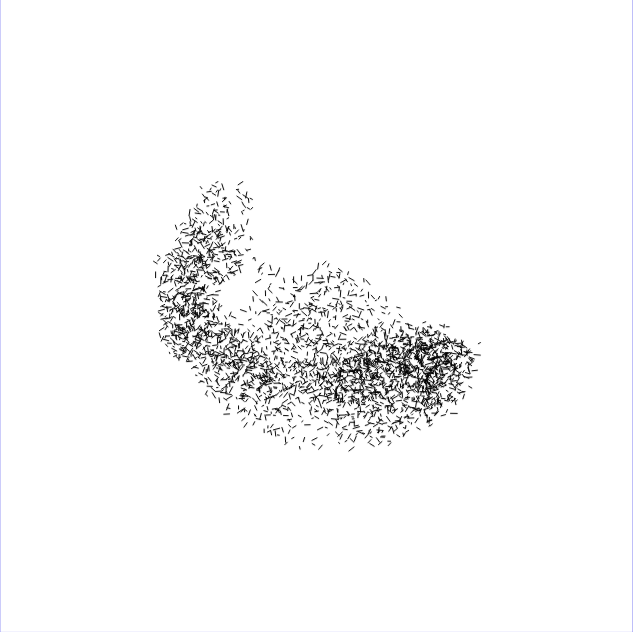

## birbs

Birbs is an implementation of the artificial life program [Boids](https://en.wikipedia.org/wiki/Boids). Based just on few simple rules it's able to simulate flocking of birds.

There are a lot of variables along with their descriptions at the top of the script that radically change the result of each execution. Enjoy!

### Gallery

