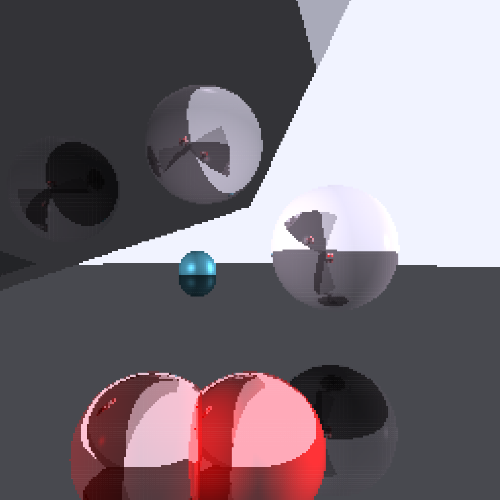

# Raytracer

This is a raytracer, currently able to render spheres and triangles, I built based on concepts learned from [Computer Graphics from Scratch](https://gabrielgambetta.com/computer-graphics-from-scratch/). I highly recommend anyone who's interested in building their own raytracer to check this out.

It has two "modes". Mainly there is the one adapted to use a post processing filter to render it as grayscale ascii-art with a limited character-set as otherwise it would for sure not have been able to be drawn by a Blot.

The second "mode", activated by changing a boolean at the top of the script, shows the raytraced result before being filtered.

