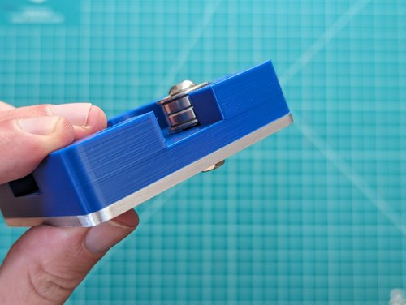
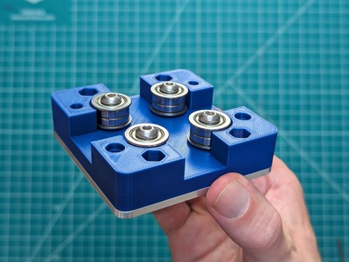
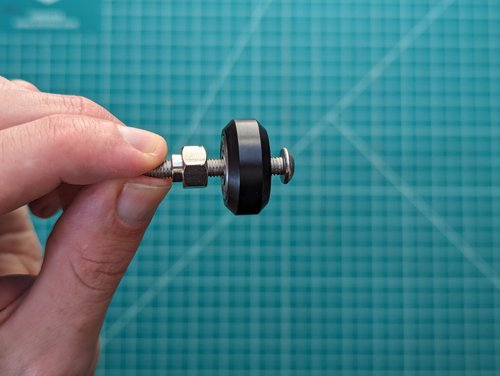
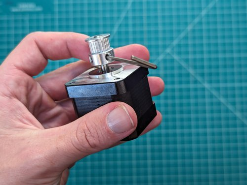
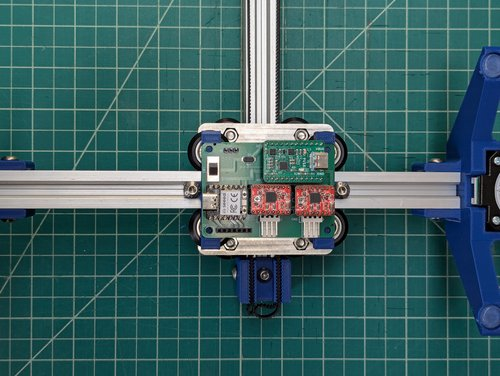
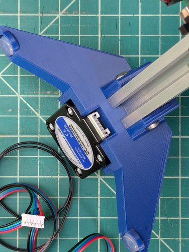

# Blot Assembly

Congratulations! You've just received your Blot (or what is soon to be your Blot)! Get ready to jump into machine building. Don't worry we'll walk through everything in detail.

If you'd like to [watch a short video (6 minutes) of building a Blot you can click here](https://www.youtube.com/watch?v=7N-Nu6_oo4I).

It takes me about 30 minutes in real time to assemble a Blot but I have lots of experience (and designed the machine). Don't be discouraged if it takes a few hours (or more) there is a lot to learn along the way.

Here are all the parts that come with your Blot. The source of truth for the Blot components is the [BOM (Bill of Materials) available here](./BOM.toml).


| Quantity | Name                                  | Image                                                                                              |
| -------- | ------------------------------------- | -------------------------------------------------------------------------------------------------- |
| 1        | 3mm allen key                         |  |
| 1        | 2.5mm allen key                       |  |
| 1        | 2mm allen key                         |  |
| 1        | 10mm wrench                           |    |
| 8        | M5x35 Button Cap Screw                |    |
| 8        | M5x25 Button Cap Screw                |    |
| 17       | M5 Nut                                |    |
| 14       | M5 T-nut                              |    |
| 1        | M5x20, knurled cylinder head          |    |
| 2        | Timing Belt Pulley                    |    |
| 14       | M5x10 Button Cap Screw                |    |
| 4        | Rubber Feet (less than .5in diameter) |    |
| 8        | M3x10 Button Cap Screw                |    |
| 1        | Carriage                              |    |
| 5        | Aluminum Spacer (1mm tall x 10mm OD)  |    |
| 1        | Tool Head                             |    |
| 5        | Eccentric Spacer (6mm tall)           |    |
| 1        | Printed Rail                          |    |
| 4        | Aluminum Spacer (6mm tall x 8mm OD)   |    |
| 2        | Motor Leg                             |    |
| 11       | 625zz V-Wheel                         |    |
| 1        | 125cm long GT2 Timing Belt            |    |
| 1        | Belt Clip                             |    |
| 10       | Flanged bearing (5x16x5mm)            |    |
| 1        | PCB Mount                             |    |
| 2        | 20mm x 20mm Aluminum Extrusion        |    |
| 2        | Stepper Motor (42mm x 42mm)           |    |
| 2        | 20mm Stepper Motor Cables             |    |
| 1        | PCB - Control Board                   |    |
| 1        | PCB - Power Board                     |    |
| 1        | Xiao RP2040                           |    |
| 2        | a4988 Stepper Motor Driver            |    |
| 1        | Servo + Arm (25mm cable)              |    |
| 1        | Carriage Plate                        |    |
| 2        | USB-C to USB-C Cable                  |    |
| 1        | USB-C Charger (Brick)                 |    |
| 1        | Pilot G-2 Roller Pen                  |    |

<!-- 
- __1 x__ 3mm allen key
- __1 x__ 2.5mm allen key
- __1 x__ 2mm allen key
- __1 x__ 10mm wrench
- __8 x__ M5x35 Button Cap Screw
- __8 x__ M5x25 Button Cap Screw
- __17 x__ M5 Nut
- __14 x__ M5 T-nut
- __1 x__ M5x20, knurled cylinder head
- __2 x__ Timing Belt Pulley
- __14 x__ M5x10 Button Cap Screw
- __4 x__ less than .5in diameter Rubber Feet
- __8 x__ M3x10 Button Cap Screw
- __1 x__ Carriage
- __5 x__ 1mm tall x 10mm OD x M5 inner Alumninum Spacer
- __1 x__ Tool Head
- __5 x__ 6mm tall x M5 inner Eccentric Spacer
- __1 x__ Printed Rail
- __4 x__ 6mm tall x 8mm OD x M5 inner Alumnium Spacer
- __2 x__ Motor Leg
- __11 x__ 625zz V-Wheel
- __1 x__ 125cm long GT2 Timing Belt
- __1 x__ Belt Clip
- __10 x__ 5x16x5mm flanged bearing
- __1 x__ PCB Mount
- __2 x__ 20mm x 20mm (face) x 250mm (tall) Aluminum Extrusion
- __2 x__ 42mm x 42mm (face) x 38mm (tall) Stepper Motor
- __2 x__ 20mm Stepper motor cables
- __1 x__ PCB - control board
- __1 x__ PCB - power board
- __1 x__ Xiao RP2040
- __2 x__ a4988 stepper motor driver
- __1 x__ Servo (25mm cable) + arm
- __1 x__ Carriage Plate
- __2 x__ usb-c to usb-c cable
- __1 x__ usb-c charger (brick)
- __1 x__ Pilot G-2 roller pen
 -->

### The carriage

The first part of the Blot we will assemble looks like this


It uses these parts:

- __4 x__ M5x25 Button Cap Screw
- __8 x__ M5x35 Button Cap Screw
- __8 x__ 625zz V-Wheel
- __8 x__ 5x16x5mm flanged bearing
- __4 x__ 6mm tall x 8mm OD x M5 inner Alumnium Spacer
- __12 x__ M5 Nut
- __4 x__ 6mm tall x M5 inner Eccentric Spacer
- __4 x__ 1mm tall x 10mm OD x M5 inner Alumninum Spacer
- __1 x__ Carriage
- __1 x__ Carriage Plate

You'll need these tools:

- __1 x__ 3mm allen key

Align the metal plate with the carriage. It will only align one way.


Well start by putting the idlers on. Begin by stacking 2 flanged bearings and a spacer on a 25mm screw.


Place that screw through the metal plate and use a nut to secure the assembly.




Repeat three more times.



Now let's attach the 8 v-wheels.

You'll notice that some of the holes are a bit larger. We'll place eccentric nuts in them which will allow us to tune the machine.


Take a 35mm screw and an eccentric nut. 



If the washer inside the bearing of the v-wheel is misaligned you can re-align it with an allen key.


Slip it into one of the larger holes and place a nut in the trap on the alternate side. Then tighten the screw.


Repeat for the other eccentric nuts.


Now let's do the same thing for the non-adjustable v-wheels.

Take a 35mm screw and a 5mm spacer with a v-wheel and assemble like below.


Attach those to the assembly as we did with the other v-wheels. With those attached our assembly is complete.


### Leg Assembly

Let's put together the legs of the machine.


You'll need these parts:

- __2 x__ Timing Belt Pulley
- __4 x__ less than .5in diameter Rubber Feet
- __8 x__ M3x10 Button Cap Screw
- __2 x__ Motor Leg
- __2 x__ 42mm x 42mm (face) x 38mm (tall) Stepper Motors

And these tools:

- __1 x__ 2.5mm allen key
- __1 x__ 2mm allen key

We'll start by placing the timing belt pulley on to the shaft of the stepper motor.


Tighten the set screw with the 2mm allen key.



Place the stepper motor into the leg with the cable port fitting into the cutout in the leg.


Secure the motor in place with the M3x10mm screws.


Place the rubber feet on the motor.


We're done!

### Pen Rail


To put together the pen rail you'll need:

- __1 x__ 3mm allen key
- __1 x__ M5x25 Button Cap Screw
- __1 x__ M5 Nut
- __1 x__ 1mm tall x 10mm OD x M5 inner Alumninum Spacer
- __1 x__ Printed Rail
- __2 x__ 5x16x5mm flanged bearing
- __1 x__ Servo (25mm cable) + arm

You'll need these tools:

- __1 x__ 3mm allen key

First put together another idler stack on a M5x25 screw.


Place a nut into the cutout on the printer rail and secure the idler to it.


### Pen Holder

Let's make the pen holder.


You'll need these parts:

- __3 x__ M5x25 Button Cap Screw
- __4 x__ M5 Nut
- __1 x__ M5x20, knurled cylinder head
- __1 x__ Tool Head
- __1 x__ 6mm tall x M5 inner Eccentric Spacer
- __3 x__ 625zz V-Wheel

You'll need these tools:

- __1 x__ 3mm allen key

Let's add the eccentric wheel first. Make a stack with the M5x25 screw like so


Attach it to the pen holder by slipping it through the printed part and securing a v-wheel on the back.


Attach the two fixed wheels with the remaining 2 M5x25 screws. 


Slip the nut into the trap on front portion of the pen holder and secure it with the knurled screw. We'll use this screw to clamp tools we place in the holder.


### Putting the machine together

Now we're ready for the machine to really come together. It will look like this.


You'll need these parts in addition to the sub-assemblies you just put together.

- **14 x** M5 T-nut
- **14 x** M5x10 Button Cap Screw
- **1 x** Belt Clip
- **1 x** PCB Mount
- **2 x** 20mm x 20mm (face) x 250mm (tall) Aluminum Extrusion

Additionally, you'll need these tools:

- **1 x** 3mm allen key
- **1 x** 10mm wrench

Begin by taking a piece of aluminum extrusion and inserting the t-nuts. I prefer to place the hole closer to the center of the bar. This will make the t-nut not visible when the part is mounted to it.


Place one of the legs on top of the end of the bar.


Secure it in place with M5x10 screws.


If the T-nut is misaligned, you can center it with the allen key.


Adjust the eccentric nuts on the carriage to make it loosely fit on the rail.


Now slide the carriage onto the rail. Notice how the aluminum plate faces the aluminum extrusion.


You can now adjust the nuts to make the wheels ride snugly. Don't make it too tight, just tight enough that the carriage doesn't rock back and fourth.


Now add the other leg.


Time to add the top rail.

Attach the printed pen rail to one end of the other extrusion.


Place that exstrusion on the carriage, adjusting the v-wheels as shown above.


Attach the belt clip to the end of the carriage facing down and secure it in place with M5x10 screws and t-nuts.


Flip the machine upside down and use the remaining two T-nuts to attach the motor mount.


### Threading the Timing Belt

For this step, you'll need the assembly you just made and the timing belt.

- **1 x** 125cm long GT2 Timing Belt


To start, turn the machine upside down.

We'll place one loop of the belt in the endcap.


Thread the belt through the carriage so a loop sticks out the other side.


Place that loop over the idler.


I now flip the Blot right-side up and use an allen key to push one loop of belt out.


Run that loop over one of the stepper motor pulleys.


Now repeat for the other side.


Pull the belt tight around the stepper motor pulley.


Flip the Blot over and fold the belt to push into the other side of the belt clamp. Make sure to pull the belt tight.


Congratulations! You've finished putting together the mechanical parts of the Blot.


### Wiring

- **1 x** PCB - control board
- **1 x** Xiao RP2040
- **2 x** a4988 stepper motor driver
- **1 x** Servo (25mm cable) + arm
- **2 x** 20mm Stepper motor cables

Insert the servo into the press fit holder. I place it so the arm is closer to the rail.


You first slip one side underneath the ledge.


Then push down on the outside edge.


Add the lever arm.


And we're done with this part.

Now assemble the control board


Make sure the potentiometers (round metal things) on the red boards are on the side with the black control board (Xiao).


Insert the control board into the machine.




Plug in all the wires.

First, plug in the servo motor wires. That's the brown, red, yellow wires. 

It's **very important** that the brown wire be on the side with the little circle. That means the metal pins will be on the inner side of the board (not facing the outer edge).


Now plug in the stepper motor wires.





The wires are a bit too long.


I like to address this by wrapping them around the feet of the Blot when they are plugged in. This can be down in different ways.


The machine will work with any configuration of how the stepper motor pins are plugged in. Depending on how your stepper motors are plugged in the drawing may be mirrored. You can correct this by changing whether the motors are plugged in with the metal pins showing face up or hidden face down. The correct orientation may be some combination of the two. I'll note this again when we cover setting the machine origin.

Note stepper motors plugged in with the metal pins up.


Note stepper motors plugged in with the metal pins down.


Adjust the eccentric nut on the pen carriage so it rides smoothly. Not too tight. Just tight enough not to jiggle.


Ready to run.

### Running Your Blot

Now it's time to run your Blot. 

[Check out a quick video demonstrating how to run a Blot here.](https://youtu.be/qDP5CNjFHJE)

To run your Blot you'll have to:

- Flash firmware to your Blot
- Connecting
  - Power your Blot.
  - Connect it to the web editor.
- Home your machine (set the origin).
- Fixture paper to draw on.
- Set the lever on the servo.
- Set the pen height for drawing.

__Flashing Firmware__

The first step to running your Blot is to flash the Blot firmware to the Xiao.

[You can download the firmware here.](https://github.com/hackclub/blot/raw/main/hardware/motor-control-board/firmware/uf2/firmware.ino.uf2)

Now to plug in your Xiao.

First hold down the boot button on your Xiao then plug it into your computer.

It should appear as a drive.

Next drop the firmware `.uf2` file onto drive.

Now the firmware is flashed.

__Connecting__

To power the Blot plug it into the USB-C brick that comes with your machine. Any USB-C brick that can deliver at least 20W should work. The Blot expects 9V 1A.


Connect your Blot to the web editor by plugging the Xiao in over USB.


Connect to your Blot by hovering over `Machine control` and selecting `Connect to machine`


If this is the first time you've connected with this Blot you'll get a pop-up to authorize the web serial connection. Select the item that says "Xiao".

__Homing__

To home your Blot.

Turn off the motors.


Manually move the Blot to the center position.


Turn on the motors.


Click `Move towards origin`. Note which corner the Blot moves towards.


Turn off the motors.


Manually move your Blot all the way to the corner it moved towards.


Click `Set Origin`.


Turn on the motors.


Depending on how your stepper motors are plugged in the drawing may be mirrored. You can correct this by changing whether the motors are plugged in with the metal pins showing face up or hidden face down. The correct orientation may be some combination of the two.

__Fixturing Paper__

Secure a piece of paper to draw on. I generally tape (or magnet down) the other side of the paper too.


__Setting Lever__

The servo lever lifts the pen. To set the servo lever range properly.

Remove the lever arm from the servo.


Set the pen to the up position in the editor.


Place the lever arm back on in the up position.

__Setting the Pen Height__

Loosen the set screw on the pen.

Move the pen to be just above the paper in the up position.

It should look like this when you are done.


__Draw!__

Pull up the art piece you want to draw in the code editor.

Hit `Run` to render the piece in the editor.


Then hover over `Machine control` and select `Run machine`.


Note that you must keep this tab active, or the communication speed (and your machine) will slow down. If you want to do something else on the computer just move the tab to a new window.

Watch Blot turn the code into a real thing.


For best results, I like to use a whiteboard ([which I bought for $10 at Target](https://www.amazon.com/Brand-Frameless-Magnetic-Dry-Erase-Board/dp/B0845T7JLC?source=ps-sl-shoppingads-lpcontext&ref_=fplfs&smid=ATVPDKIKX0DER&th=1)) with magnets to provide a flat surface and hold down paper.


### Send us a Postcard

We're building a Blot art wall back at HQ. After you build your machine pick up a local postcard and use Blot to draw your art on the back.

I picked up this cool vintage postcard from the antique store next door to Hack Club HQ. It shows a Vermont lake.


Here it is with my art piece drawn on the back. Ready to send to HQ.

Make sure you sign it too!


Hack Club HQ address is

```
Hack Club
15 Falls Rd 
Shelburne, VT 05482
USA
```

### Debugging Common Issues

Your Blot can draw quite precisely, poor performance is often due to:

- Bad wheel spacing on the carriage or pen holder.
  
  - To address this use the wrench to turn the eccentric nuts. The rails or pen holder should not move other than the direction they are intended to slide in when you shake them. The wheels should be just tight enough to hold things in place.

- Bad pen height.
  
  - If your drawing has irregular pen strokes your pen may not be low enough or your surface may be uneven.

- Machine improperly homed.

- Paper sliding.
  
  - To secure the paper you can place one end beneath the Blot.
  
  - You can use tape to secure the other side.
  
  - You can also purchase a small whiteboard with magnets. I've found this to be the most reliable technique.
